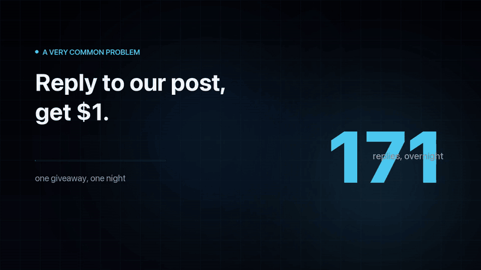

<div align="center">

# ai2human Onus

**The burden of proof is on the evidence.**

An open verification layer for AI agents. One call turns a claim plus evidence into
`approved` / `rejected` / `needs_review` — and a receipt anyone can replay.

[](LICENSE)
[](pyproject.toml)
[](#call-it-from-an-agent)
[](#measured-on-live-jev)
[](#how-it-works)



[▶ Watch the full 50-second film](https://github.com/richard7463/a2h-onus/releases/download/v0.1.0/a2h-onus-promo-en.mp4)
· [Quickstart](#quickstart)
· [How it works](#how-it-works)
· [Measured on live Jev](#measured-on-live-jev)
· [Known limitations](#known-limitations-read-before-relying-on-it)

</div>

---

You run a giveaway: *"Reply to our post, get $1."*
Overnight you get 1,000 replies. Half are `gm`, ads, bots, copy-paste.

An LLM review is slow and pricey. Doing it by hand takes all day. Paying out on
self-reported proof means paying the fakers first.

Onus is the layer in between. It grades the evidence, asks a judge only what a judge
is good at, and keeps the decision in code.

```python
from a2h_onus import verify_claim

verify_claim(claim, evidence, acceptance_criteria, value_usd, nonce)
# -> {"verdict": "approved", "evidence_grade": "E3", "receipt": {...}}
```

## Why this exists

Agents produce claims all day — *"tests pass"*, *"the post is live"*, *"the payment
cleared"*. Something has to decide whether each claim is true before code acts on it.
Today that is either brittle hand-written rules, or an expensive model call that
still gets forged evidence wrong.

Onus makes verification a **primitive**. It uses [Jev](https://typesafe.ai/) for the
semantic judgment, and it is built around the fact that **Jev will sometimes be
confidently wrong**:

1. **"Zero hallucination" is a wording trick.** Jev cannot return an option outside
   your schema. It *can* confidently pick the wrong valid one. A 0.95 wrong verdict
   is still wrong.
2. **Don't let a model compute what code can.** Nonce checks, timestamps, hash
   dedup — deterministic code, never the model.
3. **Confidence cannot rescue weak evidence.** Forged-image detection tops ~80% even
   for frontier models, so evidence below a binding threshold never auto-passes, no
   matter the score.
4. **No single closed API is load-bearing.** The judge is swappable: Jev, `kev`
   (local, free), or a model you train on your own logs.

## How it works

Four layers, each with one job. Only two of them can decide anything, and neither is
a model.

```
verify_claim(claim, evidence)
        │
        ▼
┌─────────────────────────────────────────────┐
│ L1  Provenance   — pure code, no model       │
│     nonce present? identity bound?           │
│     hash seen before? timestamp in window?   │
│     → assigns evidence grade E0–E4           │
├─────────────────────────────────────────────┤
│ L2  Perception   — (not in this release)     │
│     VLM extracts structured facts from images│
├─────────────────────────────────────────────┤
│ L3  Judgment     — Jev / kev (pluggable)     │
│     typed questions → probability + confidence│
│     only answers "is this genuine / does it  │
│     meet the criteria" — never touches money │
├─────────────────────────────────────────────┤
│ L4  Policy       — pure code, the only layer │
│     that decides. grade < E3 → never auto-   │
│     pass. (posterior, value, grade) → verdict│
└─────────────────────────────────────────────┘
        │
        ▼
  verdict + confidence + replayable receipt
```

The design rules, one line each:

- **Provenance in code, semantics in the model.** What a string match or a chain
  query can settle, the model never sees.
- **Judgment ≠ settlement.** The model outputs probabilities. Code decides the money.
- **The grade gate is absolute.** Evidence below E3 never auto-passes, however
  confident the judge is.
- **The backend is pluggable.** Speak "System One compatible", not "Jev".
- **Every verdict ships a receipt.** Grade, model version, full distribution, hash.

## Quickstart

```bash
git clone https://github.com/richard7463/a2h-onus
cd a2h-onus
python3 -m venv .venv && source .venv/bin/activate
pip install -e .

# runs offline out of the box with a mock judge (no key, no server):
JUDGMENT_BACKEND=mock python examples/verify_x_post.py
JUDGMENT_BACKEND=mock python examples/verify_onchain.py   # E4, no model call
JUDGMENT_BACKEND=mock python examples/grade_gate_demo.py  # E1 @0.99 → review
```

To run a real Jev judgment, point it at TypeSafe and pin the model version:

```bash
export JUDGMENT_BACKEND=jev
export TYPESAFE_API_KEY=...        # your own key; never commit it
export JEV_MODEL=jev-1.13.0        # pinned; never 'latest'
python examples/jev_smoke.py
```

Full walkthrough — key, first raw call, first real receipt: [`docs/connect-jev.md`](docs/connect-jev.md).

## Call it from an agent

Onus is MCP-native. Any MCP client — Claude, Codex, and others — can call
`verify_claim` directly; no account, no REST schema to read.

```bash
pip install -e ".[mcp]"
python -m a2h_onus.mcp_server
```

Two tools are exposed: `verify_claim` for one claim, `verify_batch` for many. Batch
mode returns per-item verdicts plus `auto_approve_rate`, `review_rate` and
`reject_rate` — the numbers a dashboard needs.

## Verify a gitlawb record

Onus reads [gitlawb](https://gitlawb.com), the decentralized agent-native git
network, as an evidence source. Public repositories are readable over the node's
HTTP API with no keypair and no registration, so a signed push record can be
settled in code without asking a model at all.

gitlawb signs every push. That raises an obvious question the certificate list
answers directly: **who pushed it?** Each ref-update certificate carries a
`pusher_did` separately from the repository's owner DID — so "a signed record
exists" and "the owner is accountable for it" are two different checks, and most
pipelines only do the first.

Onus requires **both**, plus a certificate that names this exact commit:

```bash
python examples/verify_gitlawb.py
```

```python
verify_claim(
    claim="Commit f0b7a571 was pushed to a2h-onus by the repo owner",
    evidence={"type": "gitlawb_commit",
              "content": {"owner": "z6Mk...", "repo": "a2h-onus",
                          "sha": "f0b7a571ec263ac2c99482d5f6688aece484bc99"}},
)
# -> evidence_grade E4, verdict approved, receipt.model_id "deterministic"
```

Three conditions must all hold before this reaches E4: the hash is in the
repository's commit list, a ref-update certificate names that exact hash, and that
certificate's `pusher_did` equals the owner DID. Anything short of the three is
downgraded to `E1` and routed to review. The check fails closed — any network or
parse error means *not verified*, never *verified*.

A commit that only ever appeared mid-push has no certificate naming it, so it
cannot be owner-attributed from this API and does not reach E4. One push produces
one certificate, covering the ref tip.

Endpoints read (all verified against a live node):

| endpoint | used for |
|---|---|
| `/api/v1/repos/{owner}/{repo}` | repository record exists |
| `/api/v1/repos/{owner}/{repo}/commits` | exact commit hash present |
| `/api/v1/repos/{owner}/{repo}/certs` | signed ref-update certificates, and the `pusher_did` that makes owner attribution possible |
| `/api/v1/repos/{owner}/{repo}/pulls` | pull request state |

**What this proves, and what it does not.** It proves that the node recorded a
signed ref update, by the owner, naming that exact commit. It says nothing about
whether the work in the commit is correct, useful, or honest — that is a judgment,
and judgments stay in the judge layer one step up.

It also does not prove that the node would have *blocked* a push from a non-owner.
gitlawb's own documentation states that write authorization is not owner-enforced by
default (`GITLAWB_ENFORCE_OWNER_PUSH` defaults to false). That policy is not visible
through the public API, so Onus reports it as `gitlawb_owner_push_enforced: null` —
unknown, not assumed.

## Measured on live Jev

Model `jev-1.13.0`, measured 2026-09-23. **Every number below was produced by the
code in this repository** — nothing here is estimated or projected.

| metric | value | reproduce with |
|---|---|---|
| judgment latency | ~0.4 s per check | `python examples/jev_smoke.py` |
| input tokens per check | ~520–570 on the `x_post` / `text` / `url` packs | `examples/jev_smoke.py` |
| cost | ~$0.02 per 1,000 checks | same call, `usage.input_tokens` |
| off-topic submissions caught | 5 / 5 | `python -m tests.gate_ab_bench` |
| fraud auto-approved by the model alone | 1 / 20 | `python -m tests.gate_ab_bench` |
| fraud auto-approved with the grade gate | **0 / 20** | `python -m tests.gate_ab_bench` |
| deterministic-layer routing | 700 / 700 | `JUDGMENT_BACKEND=mock python -m tests.run_benchmark_large` |
| deterministic-layer latency | mean 0.72 ms, p95 1.25 ms | same |

### The number that matters

Across the 30-case A/B set, the judge on its own let **one forgery through**. It
scored that forgery **0.90** — a confident, schema-valid, wrong answer. The evidence
grade behind it was `E1`, so the gate refused to auto-pass it and routed it to a
human instead. **0 / 20 with the gate.**

That is the whole argument for this repository: the model is not the safety
mechanism. The grade gate is.

### On the pass threshold

Genuine submissions score 0.51–0.56, sitting right on the 0.55 bar, so the
auto-approve rate is noisy: four consecutive runs gave 2, 3, 4 and 4 genuine
approvals out of 10. The fraud figure is stable — 1/20 by the model alone, 0/20 with
the gate, in every run. Treat the auto-approve rate as uncalibrated until it has a
larger sample.

## Known limitations (read before relying on it)

This is an early release. Be clear about what it does **not** do yet:

- **Identity is not verified yet.** An account handle in `evidence.identity` is currently taken as given. A submitter can type any handle. Real binding (OAuth / wallet signature checked against your platform's records) is the next milestone.
- **Content is not fetched from the source yet.** For `x_post` and `url`, the text is whatever the submitter sends. Fetching the post / page ourselves is on the roadmap.
- **On-chain checks are stubbed.** The E4 path exists, but the RPC lookup is not wired in.
- **Duplicate detection is exact-match.** Change one character and it's a new hash.
- **No image understanding.** Screenshots always route to human review.
- **gitlawb verification covers records, not quality.** The node confirms that a commit exists under an owner; it cannot tell you whether the work is any good. Treat a gitlawb pass as "this happened", not "this was worth paying for".
- **gitlawb owner attribution is the closest the API gets, not a guarantee.** `pusher_did == owner_did` is checked, but the node does not enforce owner-only pushes yet, so this establishes who the record *credits*, not that the node would have rejected anyone else. `gitlawb_owner_push_enforced` is returned as `null` for that reason.
- **Only ref tips carry a certificate.** A commit that was never the tip of a signed push cannot be owner-attributed and is downgraded rather than assumed.
- **gitlawb attribution is a snapshot, not a permanent property.** The certificate list covers the ref tips the node currently lists. Push again and the previous tip's certificate rolls off, so a commit that verified today may not verify tomorrow. `gitlawb_cert_list_is_snapshot` is `true` on every result for exactly this reason — persist the verdict and its receipt when you check it instead of re-deriving it later.

What it *is* good for today: a cheap first-pass filter — flag off-topic and
low-effort submissions, never auto-approve screenshots, and send humans only what is
left.

## Why the guardrails, specifically

The long version, with the failure each guardrail was built to catch:
[`docs/four-traps.md`](docs/four-traps.md). It covers the four traps that cost real
money to learn — "zero hallucination" as a wording trick, letting the model compute
what code can, trusting a confident score on a screenshot, and betting the pipeline
on one closed API.

## What this is not

- Not a task marketplace and not settlement — it decides *whether* a claim holds;
  what you do with the verdict is yours.
- Not an image forensics tool — L2 perception is not in this release; image evidence
  routes to review.
- Not tied to Jev — `kev`, NanoJev, or a model you train on your own logs all drop in.

## License

MIT. Clone it, gut it, ship your own. The judgment logs you accumulate are the real
moat — not this code.
